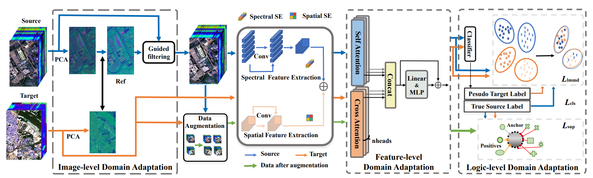

# Mind the Gap😮: Mutil-Level Unsupervised Domain Adaptation for Cross-scene Hyperspectral Image Classification, TGRS, 2024

[Mingshuo Cai](https://cfcys.github.io/),[Bobo Xi](https://scholar.google.com/citations?user=O4O-s4AAAAAJ&hl=zh-CN), [Jiaojiao Li](https://scholar.google.com/citations?user=Ccu3-acAAAAJ&hl=zh-CN&oi=sra),[Shou Feng](https://homepage.hrbeu.edu.cn/web/fengshou), [Yunsong Li](https://dblp.uni-trier.de/pid/87/5840.html), [Zan Li](https://web.xidian.edu.cn/zanli/), and [Jocelyn Chanussot](https://jocelyn-chanussot.net/).

**Code for the paper:** [Mind the Gap: Mutil-Level Unsupervised Domain Adaptation for Cross-scene Hyperspectral Image Classification](https://ieeexplore.ieee.org/document/10543066).🤩



Fig. 1. The flowchart of the MLUDA, illustrating the domain adaptation strategies at the image-, feature-, and logic-level.

## Result in 3 datasets


**Houtson 18**


**Pavia City**


**Hangzhou**

* You can download the dataset in my [google drive](https://drive.google.com/drive/folders/1MbNQZD7Fwo1zSJwzvKCmmqOuEgerWdJe?usp=sharing)!😲

## Project Page 

Now you can find more information in our page [MLUDA | Project page (cfcys.github.io)](https://cfcys.github.io/paper/MLUDA.html)!🥳

References
--

If you find this code helpful😊, please kindly cite:

> M. Cai et al., "Mind the Gap: Multi-Level Unsupervised Domain Adaptation for Cross-scene Hyperspectral Image Classification," in IEEE Transactions on Geoscience and Remote Sensing, doi: 10.1109/TGRS.2024.3407952.
> keywords: {Feature extraction;Image color analysis;Convolutional neural networks;Training;Task analysis;Visualization;Hyperspectral imaging;Cross-scene;domain adaptation;guided filter;cross attention;supervised contrastive learning},

or you can give me a little⭐!

Citation Details
--

BibTeX entry:

```
@ARTICLE{10543066,
  author={Cai, Mingshuo and Xi, Bobo and Li, Jiaojiao and Feng, Shou and Li, Yunsong and Li, Zan and Chanussot, Jocelyn},
  journal={IEEE Transactions on Geoscience and Remote Sensing}, 
  title={Mind the Gap: Multi-Level Unsupervised Domain Adaptation for Cross-scene Hyperspectral Image Classification}, 
  year={2024},
  volume={},
  number={},
  pages={1-1},
  keywords={Feature extraction;Image color analysis;Convolutional neural networks;Training;Task analysis;Visualization;Hyperspectral imaging;Cross-scene;domain adaptation;guided filter;cross attention;supervised contrastive learning},
  doi={10.1109/TGRS.2024.3407952}}
```

Licensing
--

Copyright (C) 2024 Mingshuo Cai

This program is free software: you can redistribute it and/or modify it under the terms of the GNU General Public License as published by the Free Software Foundation, version 3 of the License.

This program is distributed in the hope that it will be useful, but WITHOUT ANY WARRANTY; without even the implied warranty of MERCHANTABILITY or FITNESS FOR A PARTICULAR PURPOSE. See the GNU General Public License for more details.

You should have received a copy of the GNU General Public License along with this program.
